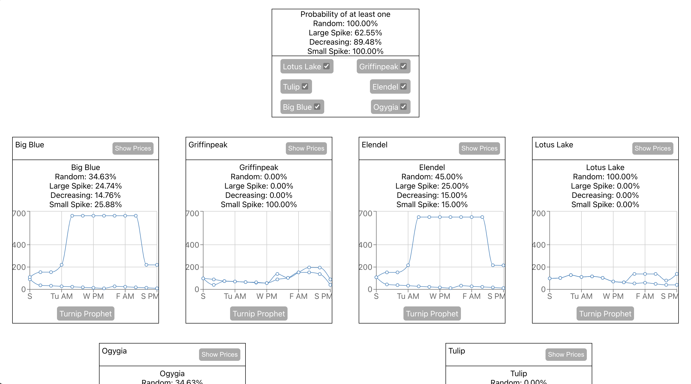

# Group Turnips

This project allows players of Animal Crossing: New Horizon to predict how the turnip stalk market will behave. The great value of this project is easily comparing multiple islands side-by-side.

## Running locally

### Prerequisites
Have a recent version of Node availble along with yarn

1. Create a Firebase project with Firestore enabled
2. Clone the repo
2. Copy `src/api/firebaseConfig.example.ts` to `src/api/firebaseConfig.ts` and populate it with your Firebase info
3. Run `yarn install`, then `yarn start`
